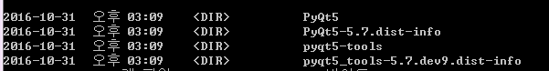

# pyqt5 setting
<h3>pyqt5</h3>

1.python install 3.5.1 (in my case)

2.use pip(python install package)

run command line
```
> pip install PyQt5
> pip install pyqt5-tools
```
3.check your directory
```
> cd Home\AppData\Local\Programs\Python\Python35\Lib\site-packages
> dir pyqt*    
```
4.you can show this


